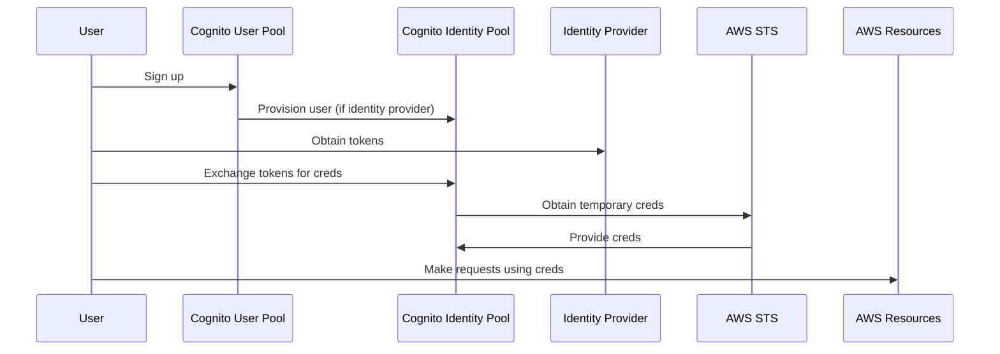

## Vocab
- **User Pool**: User directory for managing user-identity mapping.
![[Pasted image 20250107235737.png]]
- **Identity Pool**: Identity directory for manageing identity-permissions mapping.
![[Pasted image 20250108000711.png]]
- **STS**: Security Token Service allows users to request temporary limited-access credentials to users.

---
## General Notes

### High-level Authentication flow

Users sign up by creating an entry in the AWS Cognito User Pool. If the User Pool is configured as an identity provider for the Cognito Identity Pool, creating a user in the User Pool automatically provisions an entry in the Identity Pool. Authenticated and guest [[IAM]] roles are defined and attached to the Identity Pool, providing credentials for users authenticated via an identity provider or anonymous users. Users can give the tokens from their identity providers to our identity pool to obtain temporary security credentials from AWS[[IAM#STS| STS]], allowing them to make requests with permissions based on their assigned roles.

### Pricing *(first 10,000 MAU free)*
- Essentials(Default): $0.015 / MAU
- Lite: $0.0055 - $0.0025 depending on MAU

---
## Amplify's Interface

---
## Under the Amplify Hood

---
## References
- [link](https://www.google.com)