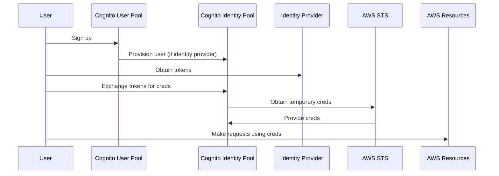

## Vocab
- **User Pool**: User directory for managing user-identity mapping.
![[Pasted image 20250107235737.png]]
- **Identity Pool**: Identity directory for managing identity-permissions mapping.
![[Pasted image 20250108000711.png]]
- **STS**: Security Token Service allows users to request temporary limited-access credentials to users.

---

## Design Details
We can authenticate a user through any OIDC provider. Said providers give us a signed JWT certifying the users identity. But how do you manage what actions this identity can perform? You could roll your own backend logic/middleware for determining this or you could use Cognito's identity pool to map identities to corresponding IAM roles with granular policies for when the identity is authenticated or when they are not. We can specify unique roles for authenticated or unauthenticated identities as Identity Pools build unique identifiers and AWS credentials for users who don't authenticate by default. Every identity is either authenticated or unauthenticated, and we attach an IAM Policy to each type. 

### Identity Pool Authentication Flow


Expanding on the second (more common in AWS) flow:
Users sign up by creating an entry in the AWS Cognito User Pool. If the User Pool is configured as an identity provider for the Cognito Identity Pool, creating a user in the User Pool automatically provisions an entry in the Identity Pool. Authenticated and guest [[IAM]] roles are defined and attached to the Identity Pool, providing credentials for users authenticated via an identity provider or anonymous users. Users can give the tokens from their identity providers to our identity pool to obtain temporary security credentials from AWS[[IAM#STS| STS]], allowing them to make requests with permissions based on their assigned roles.
### Pricing *(first 10,000 MAU free)*
- Essentials(Default): $0.015 / MAU
- Lite: $0.0055 - $0.0025 depending on MAU

---
## Amplify's Interface
### Frontend
useUser Hook
### Backend
on the backend side, its super easy to set up your cognito user pool and idenity pool with amplify. use `defineAuth` method from `@aws-amplify/backend` and configure it by providing it a json object with ur settings:
```json
import { defineAuth, secret } from '@aws-amplify/backend'; 

export const auth = defineAuth({
loginWith: {
	email: true,
	phone: true,
	groups: ["ADMINS", "EDITORS"]
	
	externalProviders: { 
		google: { 
			clientId: secret('GOOGLE_CLIENT_ID'), 
			clientSecret: secret('GOOGLE_CLIENT_SECRET')
		}, 
		signInWithApple: { 
			clientId: secret('SIWA_CLIENT_ID'), 
			keyId: secret('SIWA_KEY_ID'), 
			privateKey: secret('SIWA_PRIVATE_KEY'),
			teamId: secret('SIWA_TEAM_ID')
		},
		loginWithAmazon: { 
			clientId: secret('LOGINWITHAMAZON_CLIENT_ID'), 
			clientSecret: secret('LOGINWITHAMAZON_CLIENT_SECRET')
		}, 
		facebook: {
			clientId: secret('FACEBOOK_CLIENT_ID'), 
			clientSecret: secret('FACEBOOK_CLIENT_SECRET') },
			callbackUrls: [ 'http://localhost:3000/profile', 'https://mywebsite.com/profile' ], 
			logoutUrls: ['http://localhost:3000/', 'https://mywebsite.com'],
		} 
	},

	userAttributes: {
		prefferedUsername: {
			mutable: true,
			required: false,
		},
		birthdate: {
			mutable: true,
			required: false,
		},
		"custom:is_beta_usesr": {
			dataType: "Boolean",
			mutable: true,
		}
	}
});
```

---

---
## References
(1) [Amplfy Auth Documentaiton](https://docs.amplify.aws/react/build-a-backend/auth/)
(2) [Amplify's cognito wrapper](https://github.com/aws-amplify/amplify-js/tree/main/packages/auth/src/providers/cognito)
